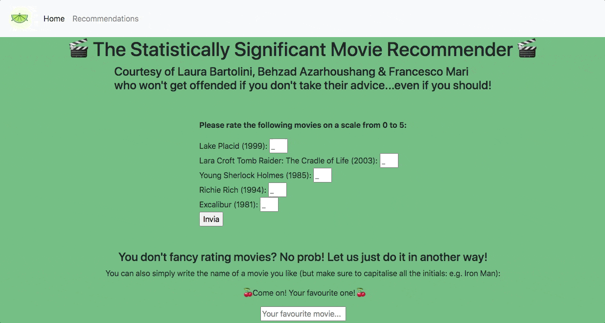

# The Statistically Significant Movie Recommender(s)

_A webapp for movie recommendations made via two different models (NMF and KNN)_

 

This webapp provides a simple interface for *two movie recommender systems*:

1. Based on the user's ratings on five different movies, the first recommender uses <b>Collaborative Filtering with Non-Negative Matrix Factorization (NMF)</b> to suggest another five titles.
2. The second recommender just asks for the title of the user's favourite movie, and uses <b>Item-Based Collaborative Filtering with K-Nearest Neighbours (KNN) and Cosine Similarity</b> to produce a list of ten similar movies.

Also features **a function to automatically update and refine the NMF model** every 12 hours on the basis of the ratings input by the webapp's users.  

|  |
| :---: |

#### Data Set
This project is based on the **Movie Lens 100k Dataset**. Click [here](https://github.com/fra-mari/Two_Movie_Recommenders/tree/main/recommender_app/data_and_models/data/MovieLensDataset#the-movie-lens-100k-dataset) for more information.

---
### Tech Stack

---
### How To Use This Code
#### On UNIX Systems

If you use MacOs or Linux, clone this repository and `cd` into the folder `recommender_app`. Then follow these simple steps:
1. Install the required Python libraries with `pip install -r requirements.txt`.

2. Generate the trained models by running `python movie_recommender.py`. The process may take a few minutes, but the module also takes care of starting the webapp once the training phase:
   - When your Terminal prints `Now starting the Flask app`, open the address `http://localhost:5000` in your browser for using the webapp, then **follow the instructions on the CLI** to decide whether to enable the automatic retraining of the models based on the ratings provided by the app's users or not.
   
   ⚠️⚠️ On some Linux versions, you may need to `apt install lsof` before running the `movie_recommender` module.
   
3. Once the files containing the model generated, you can always access the webapp running `python movies_app.py`.

**P.S.**: If you prefer to use `Docker`, just follow the instructions [in the following paragraph](https://github.com/fra-mari/two_movie_recommendation_engines#on-windows).

#### On Windows
You may recur to `WSL`, but the simplest way is probably to use `Docker`. All you have to do is:

- `cd` into the folder `recommender_app`.

- Build the image from the provided Dockerfile by running `docker build . -t movies`.

- Create and start a container by running `docker run -ti -p 5000:5000 --name recommender movies`. You will get access to the container's Bash Command Line.

- Run `python movie_recommender.py`. **Refer to [point 2](https://github.com/fra-mari/two_movie_recommendation_engines/blob/main/README.md#how-to-use-this-code) of the previous paragraph** for the next steps and options. The webapp will be available at `http://localhost:5000`.

- To quit the container's environment and CLI, you may use the command `exit`.

  

---
### Credits
The code in this repository is an extended and reworked version of the original project developed in collaboration with [Behzad Azarhoushang](https://github.com/behzad1195) and [Laura Bartolini](https://github.com/Rellino).

---
### To Do:
- [ ] Improve the CSS of the website.
- [ ] Show the movie posters of the recommended movies.
- [ ] Tests.
